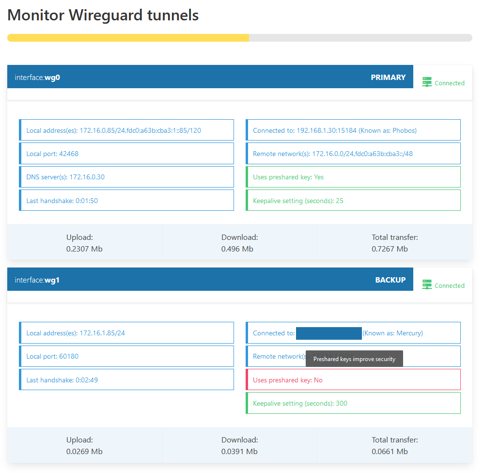

##  WireGuard clients

# Home Assistant Add-on: WireGuard Clients

WireGuard clients: managing VPN tunnels based on WireGuard

## About

This is an addon for Home Assistant. It allows to set up and manage Wireguard tunnels as a client. At the moment, Server functionality is not provided. 

After the tunnels are set up, they can be monitored through a web interface, which also provides suggestions to improve security and functionality. 

 Screenshot

## Authors & contributors

Project started as fork from Fabio Mauro's 
https://github.com/bigmoby/addon-wireguard-client
which was a fork of Franck Nijhof's 
https://github.com/hassio-addons/addon-wireguard

Both are under MIT license
Parts Copyright (c) 2020-2021 Fabio Mauro
Parts Copyright (c) 2019-2020 Franck Nijhof

Frontend inspired by Donald Zhou's
https://github.com/donaldzou/wireguard-dashboard
Available under Apache License v2
Parts Copyright (c) 2021 Donald Zou

CSS libraries by 
Bulma - https://bulma.io/
Bulma block list - https://github.com/chrisrhymes/bulma-block-list
Bulma switch - https://github.com/Wikiki/bulma-switch
Bulma tooltip - https://github.com/creativebulma/bulma-tooltip

